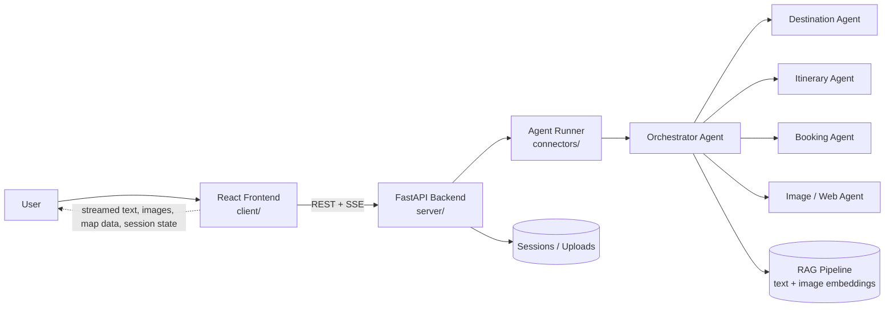

<div align="center">

# ✈️ Agent Trip Planner

**An agentic travel-planning workspace powered by multi-agent orchestration, RAG, and real-time streaming.**

Turn a vibe into a fully-planned trip — chat, maps, images, voice, and itineraries in one workspace.

[](https://react.dev/)
[](https://fastapi.tiangolo.com/)
[](https://www.python.org/)
[](https://nodejs.org/)
[](#-license)
[](#-contributing)

<br/>

[Overview](#-overview) •
[Architecture](#-architecture) •
[Setup](#-setup) •
[API Reference](#-api-reference) •
[Agent System](#-agent-system) •
[Contributing](#-contributing)

</div>

---

## 📖 Overview

**Agent Trip Planner** guides a user from a single travel *vibe* prompt into a fully realized itinerary. It combines:

| Layer | Tech | Role |
|---|---|---|
| 🎨 **Frontend** | React + Vite | Chat UI, map, gallery, uploads, voice input |
| ⚙️ **Backend** | FastAPI | REST + SSE streaming, session & upload handling |
| 🤖 **Agent Runtime** | ADK-style orchestrator | Routes tasks to specialized sub-agents |
| 🔎 **RAG Pipeline** | Dual-modal (text + image) | Destination + visual grounding for agent answers |

### ✨ Key Features

- 🧭 **Vibe → Destination flow** — visual selector guides discovery
- 💬 **Streaming chat** via Server-Sent Events (SSE)
- 🗺️ **Live geocoding & map data** for suggested destinations
- 🖼️ **Image search + PDF/image uploads** for richer context
- 🎙️ **Voice input/output** via Deepgram STT/TTS
- 🧠 **Multi-agent orchestration** for itinerary building, booking assistance, and destination matching
- 📚 **Dual-modal RAG** with local model caching for offline-friendly inference

---

## 🏗️ Architecture



**Flow summary:**
1. User starts on the React landing page and picks a travel vibe.
2. Frontend calls the FastAPI backend under `/api`.
3. Backend forwards chat/voice requests to the agent runner.
4. The orchestrator routes work to specialized sub-agents and tools.
5. UI renders streamed text, images, map data, and session state live.

---

## 📁 Repository Layout

```text
.
├── client/                      # React frontend
│   ├── src/
│   │   ├── app/
│   │   │   ├── App.tsx          # Router provider entry
│   │   │   ├── routes.ts        # App routes
│   │   │   ├── components/      # Reusable UI components
│   │   │   ├── pages/           # Home, vibe, and result pages
│   │   │   ├── services/        # Frontend API client
│   │   │   ├── stores/          # State management
│   │   │   └── styles/          # Theme and global CSS
│   │   └── main.tsx             # React app bootstrap
│   └── package.json             # Frontend dependencies and scripts
│
├── server/                      # Python backend and agent runtime
│   ├── main.py                  # FastAPI entry point
│   ├── routes/                  # REST and streaming endpoints
│   ├── connectors/              # Agent runner integration
│   ├── middlewares/             # Shared middleware
│   └── src/
│       ├── agents/              # Root agent, prompts, tools, memory, sub-agents
│       ├── RAG/                 # Dual-modal RAG pipeline and model cache
│       ├── database/            # Database models and integration helpers
│       ├── knowledgegraph/      # Knowledge graph builder and data utilities
│       ├── vectordb/            # Vector store artifacts
│       └── utils/               # Shared backend utilities
│
├── README.md
└── .gitignore
```

---

## 🖥️ Frontend

Vite + React app routed with `react-router`.

| Route | Description |
|---|---|
| `/` | Visual landing page |
| `/vibe` | Destination vibe selection |
| `/result` | Main workspace — chat, map, gallery, uploads |

**Responsibilities:** render the travel UI, stream chat responses, handle uploads & voice, display geocoded map results and image search results.

**Entry points:**
- [`client/src/main.tsx`](client/src/main.tsx)
- [`client/src/app/App.tsx`](client/src/app/App.tsx)
- [`client/src/app/routes.ts`](client/src/app/routes.ts)
- [`client/src/app/services/api.ts`](client/src/app/services/api.ts)

---

## ⚙️ Backend

FastAPI application exposing the trip-planning API under `/api`.

**Responsibilities:** stream chat over SSE, create/inspect sessions, proxy image search & geocoding, accept uploads, process voice (STT → agent → TTS), mount the agent runtime.

**Entry points:**
- [`server/main.py`](server/main.py)
- [`server/routes/chat.py`](server/routes/chat.py)
- [`server/routes/session.py`](server/routes/session.py)
- [`server/routes/images.py`](server/routes/images.py)
- [`server/routes/geocode.py`](server/routes/geocode.py)
- [`server/routes/upload.py`](server/routes/upload.py)
- [`server/routes/voice.py`](server/routes/voice.py)

---

## 🤖 Agent System

Core orchestrator lives in [`server/src/agents/agent.py`](server/src/agents/agent.py), with routing logic in [`server/src/agents/orchestrator.py`](server/src/agents/orchestrator.py).

**Capabilities:**
- 🎯 Destination matching and filtering
- 🗓️ Itinerary creation
- 🎫 Booking-oriented assistance
- 🖼️ Image analysis
- 🌐 Web automation and scraping support
- 🧠 Knowledge graph lookups and travel-specific search

### RAG & Models

| Component | Model |
|---|---|
| Text embeddings | `BAAI/bge-base-en-v1.5` |
| Image embeddings | `openai/clip-vit-base-patch32` |
| Cache directory | `server/src/RAG/models/` (git-ignored) |

> **Note:** Model weights are downloaded once and cached locally — they are never committed to version control.

**One-time model download:**

```bash
python server/src/RAG/download_models.py
```

---

## 🔌 API Reference

| Method | Endpoint | Description |
|---|---|---|
| `POST` | `/api/chat` | Streams SSE chat chunks |
| `POST` | `/api/chat/sync` | Returns a full chat response |
| `POST` | `/api/session` | Creates a new session |
| `GET` | `/api/session/{session_id}` | Returns session metadata |
| `GET` | `/api/images/search?q=...&max=...` | Searches for destination images |
| `GET` | `/api/geocode?place=...` | Geocodes a place name |
| `POST` | `/api/upload` | Uploads an image or PDF |
| `POST` | `/api/voice/process` | STT → agent reasoning → TTS |
| `GET` | `/api/health` | Backend health check |

---

## 📋 Requirements

- **Node.js** 18+ (frontend)
- **Python** 3.11+ (backend, recommended)
- An environment capable of installing Python dependencies
- **Deepgram API keys** for voice input/output (optional)

---

## 🚀 Setup

### 1. Frontend

```bash
cd client
npm install
npm run dev
```

### 2. Backend

```bash
cd server
python -m venv .venv
.venv\Scripts\activate      # Windows
# source .venv/bin/activate # macOS/Linux
pip install -r requirements.txt
uvicorn main:app --reload --port 8000
```

> **Note:** The frontend and backend are developed separately — run both during local development. The chat experience requires the backend to be reachable at `/api`.

---

## 🔐 Environment Variables

Loaded from `server/src/agents/.env` at startup:

| Variable | Purpose |
|---|---|
| `DEFAULT_MODEL` | Orchestrator model selection |
| `DEEPGRAM_STT_API_KEY` | Voice transcription |
| `DEEPGRAM_TTS_API_KEY` | Voice synthesis |
| `RAG_*` | RAG pipeline configuration overrides |

---

## 🛠️ Development Notes

- Uploaded files are stored under `server/uploads/`.
- RAG model assets are intentionally excluded from Git history via `.gitignore`.
- Run frontend and backend concurrently during local development for the full experience.

---

## 📌 Status

This repository currently contains a **working application skeleton** with substantial agent, RAG, and UI code already implemented. This README is meant to give a full picture of the project and point contributors to the key entry points for further work.

---

## 🤝 Contributing

Contributions, issues, and feature requests are welcome. Feel free to check the [issues page](../../issues) or open a PR.

## 📄 License

Distributed under the MIT License. See `LICENSE` for details.

<div align="center">

Made with ⚙️ + 🤖 by the Agent Trip Planner team

</div>
